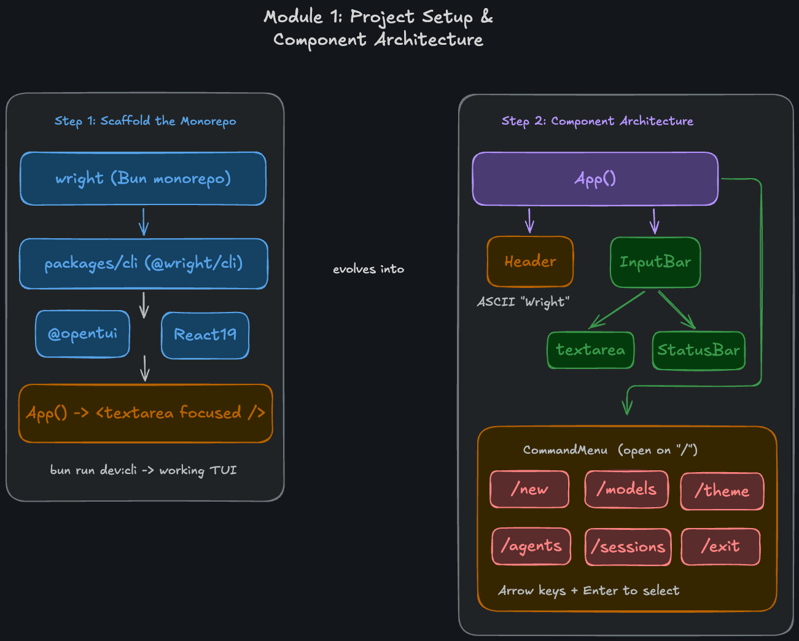

## Module 1: Project Setup & Component Architecture
In this module, we will scaffold the initial structure of the `wright` CLI agent and build its foundational Terminal UI (TUI) components. 

### Step 1: Scaffold the Monorepo
We are using Bun workspaces to structure our monorepo.
1. Initialize a new project and configure the root `package.json` to define the workspaces (e.g., `packages/*`).
2. Set up shared configurations like `tsconfig.base.json` in the root.
3. Create the first package at `packages/cli` named `@wright/cli`.
4. Install the core UI dependencies for the CLI:
   - `@opentui/core` and `@opentui/react` (for building terminal interfaces with React).
   - `typescript` and `@types/react`.

### Step 2: Component Architecture
We will set up the main entry point (`src/index.tsx`) and the foundational React components for our TUI.

- **App Initialization (`src/index.tsx`)**: 
  - Initialize the `@opentui` renderer (running at 60 FPS, with a bottom overlay console).
  - The root `App` component will render a layout containing our two main sections: `<Header />` and `<InputBar />`.

- **Header (`src/components/header.tsx`)**:
  - Displays the ASCII art title "Wright" at the top of the screen.

- **InputBar (`src/components/input-bar.tsx`)**:
  - Contains the main `<textarea>` for user input. It should be focused by default.
  - Contains a `<StatusBar>` below the text area to show the current context or hints.

- **Command Menu (`src/components/command-menu/`)**:
  - An interactive slash-command menu that opens conditionally when the user types `/` in the `InputBar`.
  - **Available Commands**: `/new`, `/models`, `/theme`, `/agents`, `/sessions`, `/exit`.
  - Supports navigation using the **Arrow Keys** and selection using **Enter**.
  - Built with specialized hooks (`use-command-menu.ts`) and filtering logic (`filter-command.ts`) to handle user interaction smoothly.

### Execution
Add a script in `package.json` to run the project. Running `bun run dev:cli` will launch the CLI. You should see a working terminal UI with the ASCII header and a functional input bar that triggers the slash command menu!
