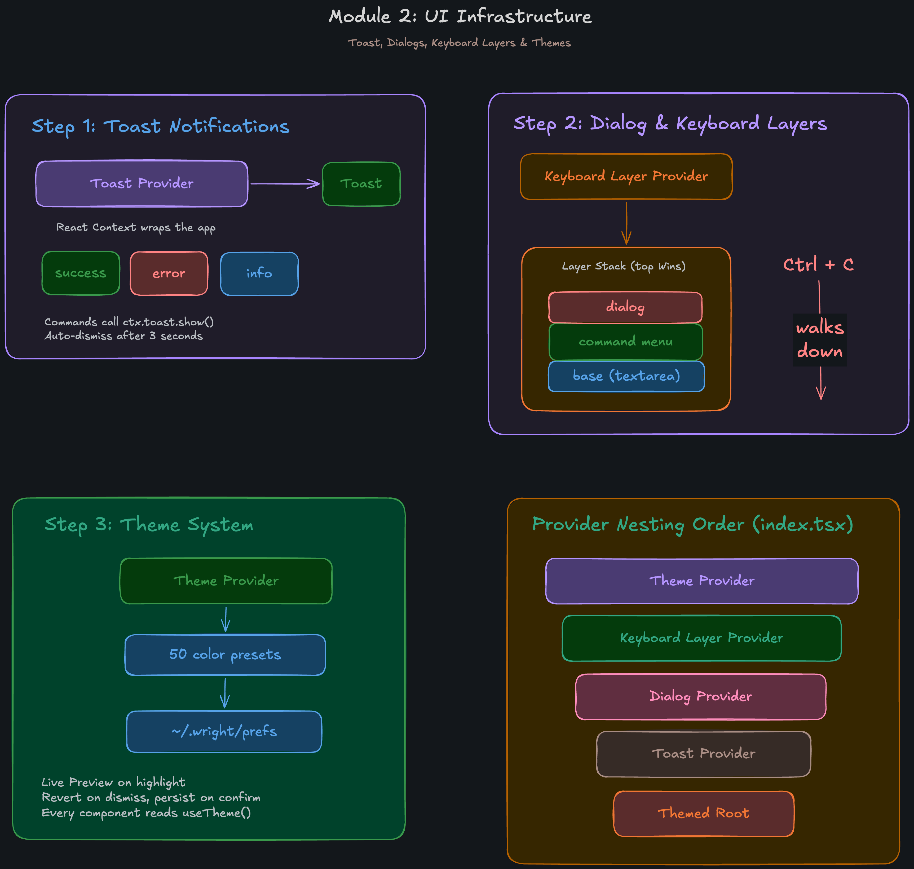

## Module 2: UI Infrastructure
This module establishes the foundational UI systems required for a robust terminal application, including theming, keyboard event delegation, dialogs, and toast notifications.

### Step 1: Toast Notifications
We implement a global notification system to provide non-blocking feedback to the user.
- **Toast Provider**: A React Context (`providers/toast`) that wraps the application state.
- **Variants**: Supports `success`, `error`, and `info` toast types.
- **Usage**: Commands and components can call `ctx.toast.show()` to display a toast message.
- **Behavior**: Toasts are configured to auto-dismiss after 3 seconds.

### Step 2: Dialog & Keyboard Layers
In a terminal environment, managing which component receives keyboard input is critical. We solve this using a layered priority stack.
- **Keyboard Layer Provider**: Manages an active stack of UI layers (`providers/keyboard`).
- **Layer Priority (Top Wins)**:
  1. `dialog` (highest priority - e.g., the Theme selection dialog)
  2. `command menu` (slash commands)
  3. `base` (the main textarea input)
- **Escape Hatch (`Ctrl + C`)**: Pressing `Ctrl + C` walks down the layer stack. If a dialog is open, it closes the dialog. If the command menu is open, it dismisses the menu. It only exits the app if the base layer is the only active layer.

### Step 3: Theme System
A comprehensive theming engine allows users to customize the CLI's appearance.
- **Theme Provider**: Manages the active color palette globally (`providers/theme`).
- **Presets**: Includes 50 built-in color presets defined in `src/theme.ts`.
- **Persistence**: User preferences are saved locally to `~/.wright/prefs`.
- **Interactive Previews**: When navigating the `/theme` dialog, highlighting a theme provides a live preview. Dismissing reverts to the previous theme, while confirming persists the new choice.
- **Integration**: Every UI component accesses the current color palette via the `useTheme()` hook.

### Provider Nesting Order
To ensure all these systems work seamlessly together, the application root (`src/index.tsx`) wraps the core UI in a strict provider tree order:
1. `<ThemeProvider>` (Outermost)
2. `<KeyboardLayerProvider>`
3. `<DialogProvider>`
4. `<ToastProvider>`
5. `<ThemedRoot>` (Innermost layout containing the Header, InputBar, etc.)
