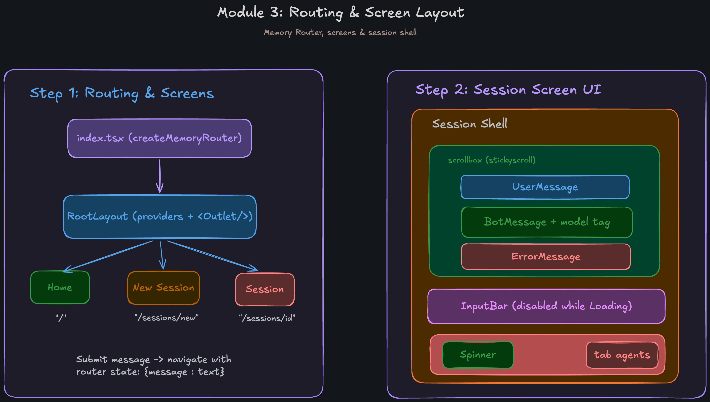

## Module 3: Routing & Screen Layout
This module introduces client-side routing using `react-router` and establishes the screen layout architecture, allowing the application to navigate between different views (like home, new session, and active sessions) while preserving state and UI layers.

### Step 1: Routing & Screens
We integrate `react-router` for navigation, utilizing a memory router which is the standard approach for CLI applications.

- **Router Setup (`src/index.tsx`)**: The static App component was replaced by a `RouterProvider` fed with a `createMemoryRouter`. 
- **Root Layout (`src/layouts/root-layout.tsx`)**: This acts as the foundational layout wrapper. Instead of declaring providers directly in `index.tsx`, they are consolidated here. It wraps the app in the following strict order: `<ThemeProvider>`, `<KeyBoardProvider>`, `<DialogProvider>`, `<ToastProvider>`, `<ThemedRoot>`, and finally an `<Outlet />` where the active screen is rendered.
- **Available Routes & Screens**:
  - **`Home`** (`/`): Implemented in `src/screens/home.tsx`. It renders the centered `<Header />` and `<InputBar />`. When a user submits a prompt, it utilizes `navigate("/sessions/new", { state: { message: text }, replace: true })` to move to the new session view.
  - **`New Session`** (`/sessions/new`): Implemented in `src/screens/new-session.tsx`. It reads the submitted prompt from `location.state.message`. If no message is found, it automatically redirects back to `/`. Otherwise, it renders the `SessionShell`.
  - **`Session`** (`/sessions/:id`): Implemented in `src/screens/session.tsx`. Designed to load an existing conversation using the `id` from `useParams()`.

### Step 2: Session Screen UI
The core interface where the user interacts with the AI agent is encapsulated in a reusable shell component.

- **Session Shell (`src/components/session-shell.tsx`)**: A flex-column container that takes up the entire terminal space. 
  - **Message List (Scrollbox)**: It uses an `@opentui` `<scrollbox flexGrow={1} stickyScroll stickyStart="bottom">`. This ensures that as new tokens stream in, the view remains automatically anchored to the latest messages at the bottom.
  - **Input Area**: The `<InputBar>` is placed immediately below the scrollbox. It respects the `inputDisabled` prop, locking the text area when the agent is actively generating.
  - **Status/Indicators**: The bottom row uses a flex layout to render an `opentui-spinner` (if `loading` is true) and a "tab agents" dim text hint aligned to the right using `marginLeft="auto"`.

### Step 3: Message Components
We added modular message components in `src/components/messages/` to cleanly separate the rendering logic for different chat blocks.
- **`UserMsg`**: Renders the user's prompt with a primary-colored left border (using specialized characters `┃` and `╹` for aesthetic corners) and a surface-colored background.
- **`BotMsg`**: Renders the agent's response text and includes a footer row featuring a primary-colored dot `◉` alongside the LLM model name (e.g., `opus-4-8`).
- **`ErrorMsg`**: Similar to `UserMsg`, but uses the `colors.error` theme for its left border to distinguish failure states visually.
