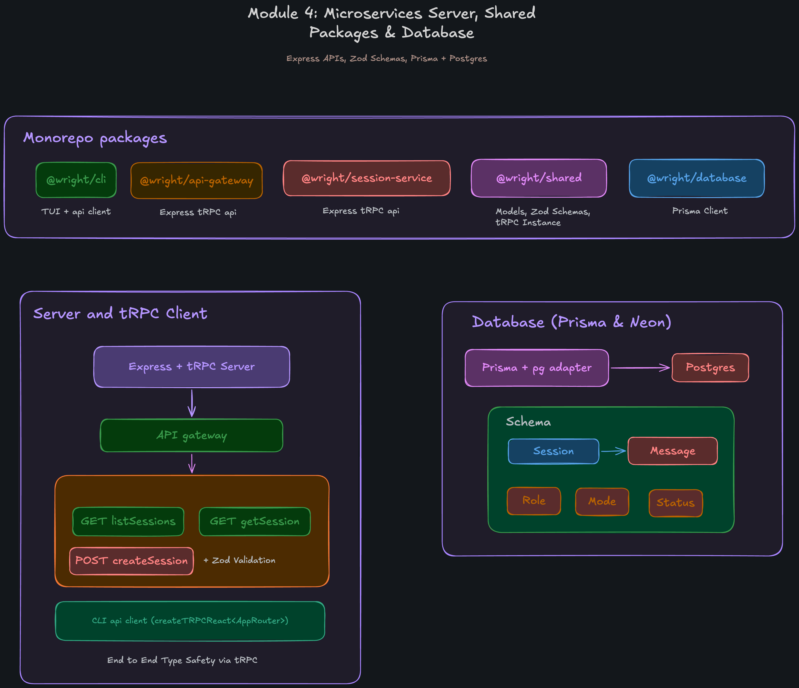

## Module 4: Microservices Server, Shared Packages & Database
This module establishes a robust Express and tRPC-based microservices architecture, backed by a Prisma and PostgreSQL database layer.

### 1. Monorepo Package Breakdown
The backend has been modularized into distinct, purpose-built packages within the monorepo:
- **`@wright/api-gateway`**: An Express server acting as the entry point for frontend requests. It uses `http-proxy-middleware` to route `/api` traffic to the underlying microservices.
- **`@wright/session-service`**: An Express microservice that hosts the tRPC router for managing sessions. It runs on a dedicated port and handles business logic.
- **`@wright/shared`**: A central package containing the base tRPC instance initialization (`initTRPC`), common Zod schemas, and shared models to guarantee type consistency across the monorepo.
- **`@wright/database`**: A dedicated database package containing the Prisma schema, migrations, and the generated Prisma Client connected to a Postgres (Neon) instance.
- **`@wright/cli`**: The TUI frontend which now consumes the backend using `@trpc/client` and `@trpc/react-query`, maintaining 100% end-to-end type safety.

### 2. tRPC and Express Integration
The `session-service` leverages tRPC to define highly type-safe API endpoints:
- **`listSessions`**: Queries the database to return all sessions ordered by creation date.
- **`getSession`**: Fetches a specific session and its nested messages.
- **`createSession`**: Validates incoming payload using Zod and creates a new session in the database, optionally along with an `initialMessage`.

**Validation and Error Tracking**:
A custom tRPC middleware (`createSessionValidatorMiddleware`) intercepts requests. If Zod validation fails, it automatically logs the error issues and path to **Sentry** (`@sentry/bun`) before throwing a standard tRPC Error.

### 3. Database Architecture (Prisma + Postgres)
The `@wright/database` package introduces a relational schema tailored for an AI chat agent:
- **`Session` Model**: Tracks the overarching conversation, including the user's `cwd` (current working directory) and `title`.
- **`Message` Model**: A one-to-many relationship with `Session`. Tracks individual AI and User messages, including the `model` used, `duration` of the generation, and `parts` (for multi-modal or function-calling payloads).
- **Enums**: Strict enums are enforced at the database level for `Role` (`USER`, `ASSISTANT`, `ERROR`), `Mode` (`BUILD`, `PLAN`), and `MessageStatus` (`COMPLETED`, `INTERRUPTED`).

The Prisma client is isolated and generated into a local `generated/prisma` directory to prevent conflicts and ensure clean module resolution across the monorepo workspaces.
