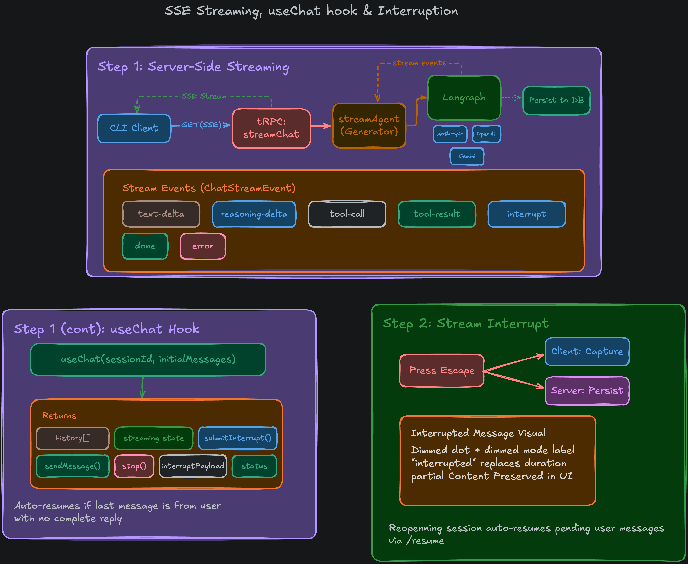

## Module 5: Agent Flow & Streaming Architecture
This module introduces the core LangGraph-powered AI agent, Server-Sent Events (SSE) streaming, and the robust frontend synchronization layer.

### 1. The `@wright/agent` Package (LangGraph)
A new dedicated package was introduced to handle the complex AI orchestration.
- **StateGraph Architecture**: Built using `@langchain/langgraph`, the agent operates on a simple `AgentState` containing a single `messages` array. It uses a `callModel` node to invoke the LLM (with dynamic tool binding) and a `toolNode` to execute tools.
- **The Streaming Generator**: `streamAgent` is an `async generator` that consumes LangGraph's `streamEvents` (v3). It normalizes underlying events into a custom `ChatStreamEvent` type (`text-delta`, `reasoning-delta`, `tool-call`, `done`, `error`, `interrupt`) for consumption by the frontend.
- **PostgreSQL Checkpointing**: LangGraph uses a Postgres-backed checkpointer (`@langchain/langgraph-checkpoint-postgres`) connected via a native `pg` Pool to persist its internal memory/thread state natively across runs.
- **Cross-Run Database Deduplication**: As the stream progresses, completed AI responses and tool results are idempotently persisted to the overarching PostgreSQL database by comparing against the message IDs natively generated by LangGraph.

### 2. `@wright/chat-service` & tRPC Subscriptions
The microservices backend was expanded to support live streaming.
- **The `streamChat` Endpoint**: Implemented as a tRPC `subscription` utilizing modern native SSE capabilities. It wraps `streamAgent` and yields events directly to the client over an open HTTP connection.
- **Robust Middleware**: `sessionValidatorMiddleware` dynamically parses the raw connection input to query PostgreSQL and ensure the `sessionId` exists before allowing the heavy LangGraph process to boot. `chatValidatorMiddleware` traps schema validation errors and pipes them to Sentry.
- **Proxy Routing**: The `@wright/api-gateway` was updated with a precise `pathFilter` regex (`/^\/api\/chat(?:[./]|$)/`) to seamlessly proxy streaming SSE connections to the `chat-service` on port 3002.

### 3. Frontend Chat Experience & Synchronization (`useChat`)
The CLI frontend underwent a massive upgrade to support live streaming while maintaining strict state synchronization.
- **The `useChat` Hook**: A highly complex custom hook leveraging `@trpc/tanstack-react-query`'s `useSubscription` to receive SSE events. It holds temporary state for `streamedContent`, `streamedReasoning`, and `activeToolCalls`.
- **Single Source of Truth Pattern**: Once the `done` event is received, `useChat` clears its temporary streaming state and invalidates the `getSession` React Query. The UI automatically flashes from the "live scratchpad" to the permanently persisted PostgreSQL database state, eliminating optimistic UI bugs.
- **Graceful Cancellation (AbortSignal)**: When the user presses `ESC`, the tRPC query is disabled, severing the network connection. This propagates down to the backend as a native `AbortSignal`, which forces LangGraph to drop the `fetch` request mid-stream. The backend catches the `AbortError` and saves the cut-off message to PostgreSQL with `status: INTERRUPTED`. Crucially, LangGraph's checkpointer intentionally rolls back the failed execution, ensuring the AI retains a clean, uncorrupted context window for future resumptions.
- **Human-in-the-loop (HITL)**: Introduced a mechanism to catch `interrupt` payloads from LangGraph's state tasks. Exposing an `InterruptPrompt` in the UI allows the user to approve/deny dangerous actions and seamlessly resume the stream using LangGraph's `Command({ resume: answer })` API.
