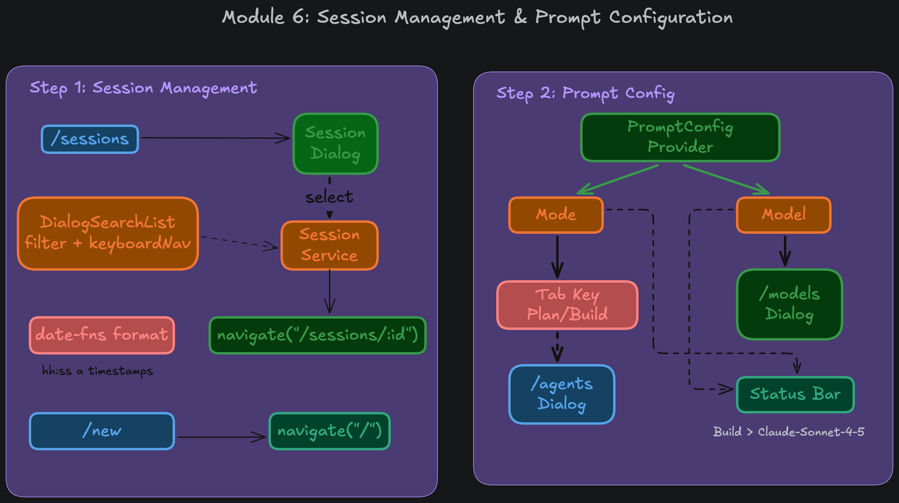

## Module 6: Session Management & Prompt Configuration

This module introduces the frontend capabilities for navigating past conversations, securely managing provider credentials, and dynamically configuring the agent's behavior via models and reasoning efforts.

### 1. Session Management

- **The `/sessions` Command**: Exposes a global command that opens the `SessionsDialog`. It utilizes TanStack React Query to fetch historical chats via the tRPC backend.
- **Elegant Loading UX**: Integrates an aesthetic `Spinner` component to gracefully handle network latency during data fetching, preventing the jarring UI flicker of an empty list on slower connections.
- **Search & Navigation**: Employs the highly reusable `DialogSearchList` to provide fuzzy filtering and fast keyboard navigation. Timestamps are cleanly formatted using `date-fns` (e.g., `hh:mm a`). Selecting a session dynamically navigates the router to `/sessions/:id`.
- **The `/new` Command**: Provides a rapid escape hatch, instantly routing the user back to the root `/` to initialize a clean slate.

### 2. Prompt Configuration & Global State

- **The `PromptConfigProvider`**: Acts as the centralized React Context for all chat preferences, persistently saving state to `~/.wright/prefs.json`. It controls the active `Mode`, `Model`, `providerApiKeys`, and `reasoningEffort`.
- **Mode Toggling (Plan vs. Build)**: Pressing the `TAB` key instantly toggles the agent between `Build` and `Plan` modes. The UI responds dynamically, such as changing the `InputBar` left border color (switching to a distinct color for planning versus building).
- **The Status Bar**: Natively subscribes to `PromptConfigProvider` to continually broadcast the current state (e.g., `Build › gpt-4o`), ensuring the user always knows the exact context of their upcoming message.

### 3. Provider-Aware Model Selection & API Key Security

- **Hierarchical Selection Flow**: The `/models` command was re-engineered into a nested pipeline: `ProvidersDialog` ➔ `ModelsDialog` ➔ `EffortDialog` (if applicable). This categorizes massive model lists strictly by their vendor (OpenAI, Anthropic, Google).
- **Just-In-Time (JIT) Key Prompting**: The globally exposed and insecure `/apikeys` command was completely removed. Instead, when a user selects a provider, the system instantly checks for a stored API key. If missing, a secure `ApiKeyInputDialog` intercepts the flow, taking the key and saving it seamlessly before continuing to the model list.
- **Hidden Hotkeys for Key Management**: If a key expires or needs updating, the user can press a subtle `[K]` hotkey embedded in the `ModelsDialog` footer to overwrite the existing key, keeping the UI clean and contextual.
- **Dynamic Reasoning Capabilities**: Automatically detects reasoning-capable "frontier" models using prefix matching (e.g., `o1`, `o3`, `gpt-5`, `gemini-3*`, `gemini-2.0-flash-thinking`).
- **Provider-Aware Efforts**: The `EffortDialog` perfectly mirrors the technical spec of the chosen provider. It dynamically presents 6 tiers for OpenAI (`none` to `max`) and exactly 4 tiers for Google (`low` to `high`), eliminating configuration ambiguity.
- **Compute Overhead Badges**: Both the `StatusBar` and historical `BotMsg` components explicitly tag reasoning models with their active effort level (e.g., `Build › o3 (Max)`), keeping the developer constantly informed of the compute overhead they are utilizing.
